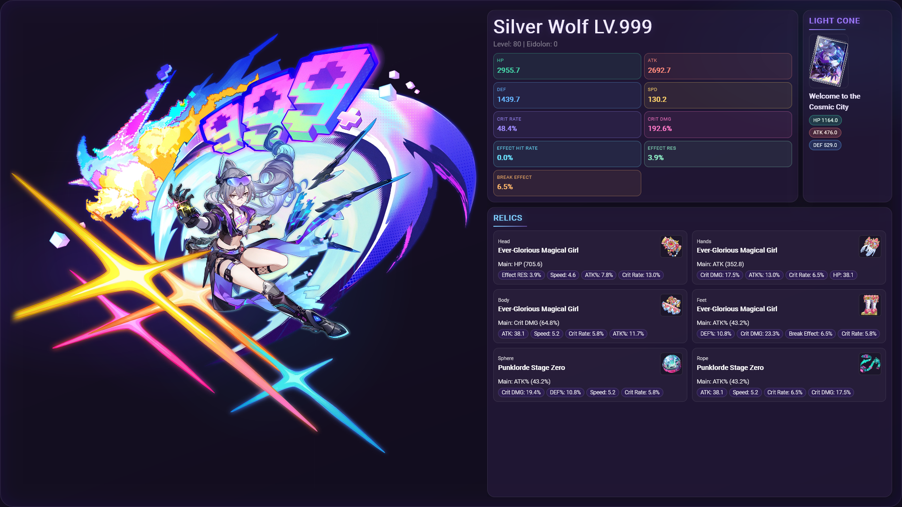
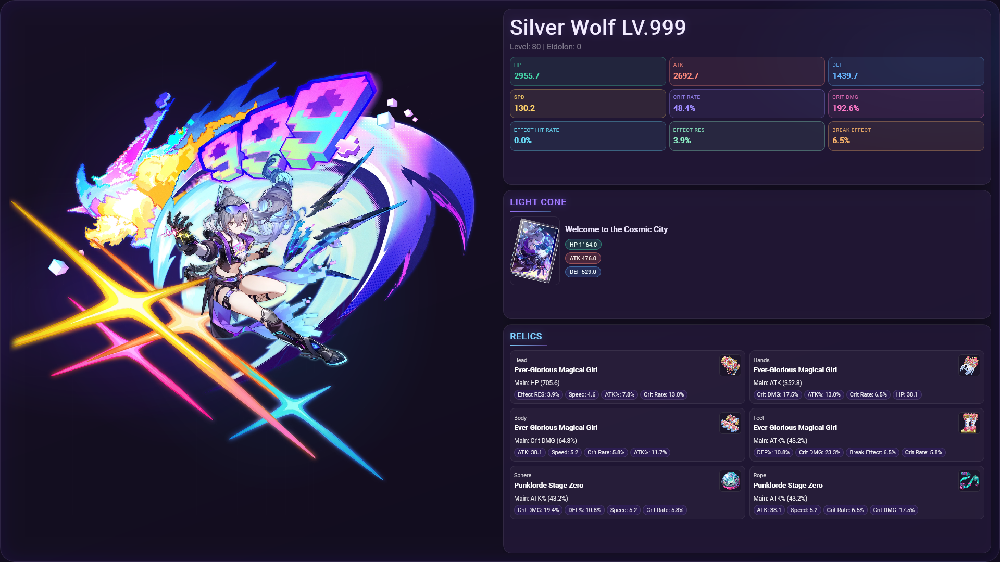

# HSR Card Maker

Fan-made web app for **Honkai: Star Rail** that displays character stats and builds from a user-provided JSON file, generating visual character cards. This project is not affiliated with or endorsed by HoYoverse.

## Live Demo

Try the app here: **[hsr-card-maker.vercel.app](https://hsr-card-maker.vercel.app/)**

## How to use

### Import from config.json
1. Upload a config.json with your characters data.
2. Select or search the character you want to see.
3. Use the download button to export a PNG image of your character card using the available presets (or take a screenshot).

### Import from UID
1. Click the Import from UID button.
2. Enter your UID and click Enter.
3. Wait for the app to fetch your character data from the API and generate the character cards.
4. To see more characters, you have to select them in the character list from your in-game profile and log off or wait 5 minutes (Max 8 characters can be fetched using this method).

## Presets Examples
**Balanced - Large Screen**


**Balanced - Small Screen**


**Light Cone Focus - Large Screen**


**Light Cone Focus - Small Screen**


## Project structure

```text
HSR-Card-Maker/
├── Assets/        # Images, icons and other assets used by the web app
├── Scripts/       # JavaScript files for the app logic
├── index.html     # Main web page
├── style.css      # Styles for the app
├── vercel.json    # Vercel deployment configuration
├── LICENSE        # AGPL-3.0 license
└── README.md
```

## FAQ

### What is a config.json file?

A config.json is a resource that some private servers use to load such things like battle info and character info to the game.

### How the config.json file should look like?

Here is an example with placeholder data:

```json
"avatar_config": [
    {
      "name": "CHARACTER_NAME",
      "id": CHARACTER_ID,
      "hp": CURRENT_HP,
      "sp": CURRENT_ENERGY,
      "level": CHARACTER_LEVEL,
      "promotion": PROMOTION,
      "rank": EIDOLON_NUMBER,
      "lightcone": {
        "id": LIGHTCONE_ID,
        "rank": SUPERIMPOSE_NUMBER,
        "level": LIGHTCONE_LEVEL,
        "promotion": PROMOTION
      },
      "relics": [
        "RELIC_HEAD",
        "RELIC_HAND",
        "RELIC_BODY",
        "RELIC_FEET",
        "RELIC_SPHERE",
        "RELIC_ROPE"
      ],
      "use_technique": true,
    }
]
```

And here is an example using Welt:

```json
"avatar_config": [
    {
      "name": "Welt",
      "id": 1004,
      "hp": 100,
      "sp": 50,
      "level": 80,
      "promotion": 6,
      "rank": 6,
      "lightcone": {
        "id": 23024,
        "rank": 1,
        "level": 80,
        "promotion": 6
      },
      "relics": [
        "61171,15,1,4,5:3:6,7:1:2,8:3:6,9:2:4",
        "61172,15,1,4,5:3:6,7:1:2,8:3:6,9:2:4",
        "61173,15,5,4,10:1:2,5:4:8,7:1:2,8:3:6",
        "61174,15,2,4,2:1:2,7:2:4,8:3:6,9:3:6",
        "63095,15,10,4,6:1:2,9:3:6,8:3:6,5:2:4",
        "63096,15,4,4,4:1:2,7:1:2,8:3:6,9:4:8"
      ],
      "use_technique": true,
      "buff_id_list": [
        1000117
      ]
    }
]
```

### How can I generate a config.json file?

There are external online tools that can generate config.json files and freesr-data.json files, here are some of them:
- **Relic Builder**: https://relic-builder.vercel.app
- **SRTools**: https://srtools.neonteam.dev

## Notes
- **[WIP]** Compatibility with freesr-data.json files
- Character stats will probably not be accurate to the in-game stats since currently it does not take in count things like lc passives, relic passives or traces.
- Characters that are not in the live version **(4.1)** but in the beta version **(4.1.53)** may appear with missing assets and their stats can not be up-to-date until the next live version.

## License

This project is licensed under the **GNU Affero General Public License v3.0 (AGPL-3.0)**.  
See the [`LICENSE`](./LICENSE) file for details.

## Credits and copyrights

- **Game assets** (characters, icons, etc.) are property of **© HoYoverse** and are used here under fan content guidelines. This is a fan-made project with no official affiliation to HoYoverse.
- This project uses resources organized in the **[StarRailRes](https://github.com/Mar-7th/StarRailRes)** repository (licensed under AGPL-3.0) as a source for some assets and IDs.

If HoYoverse or any rights holder requests removal or changes regarding copyrighted materials, they will be complied with.